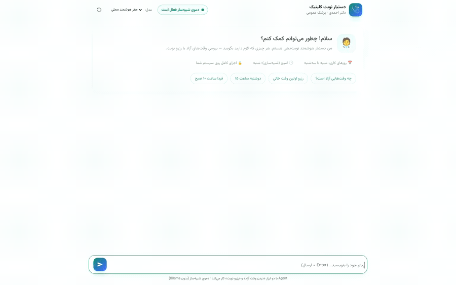
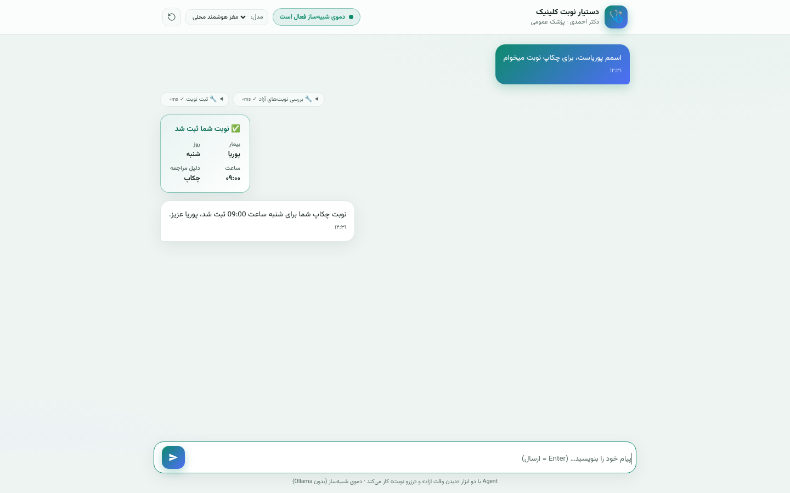
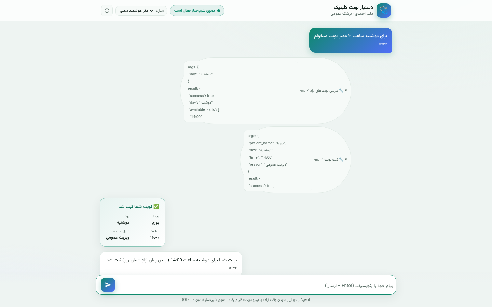
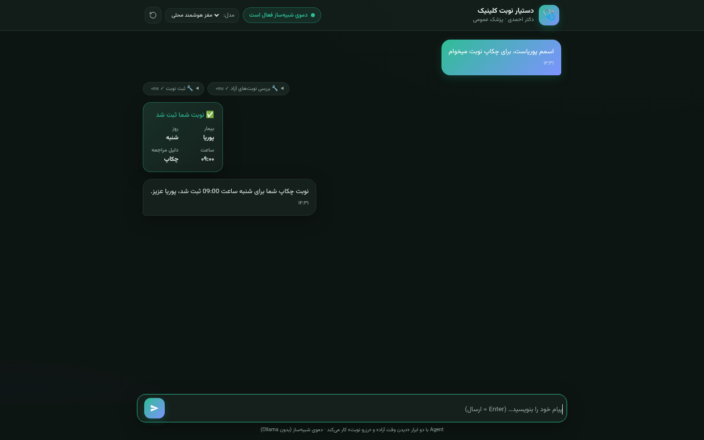
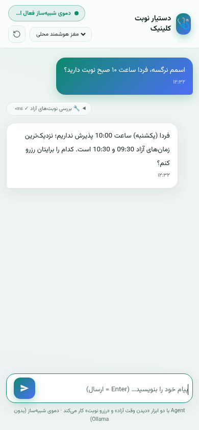
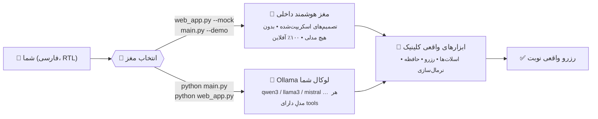
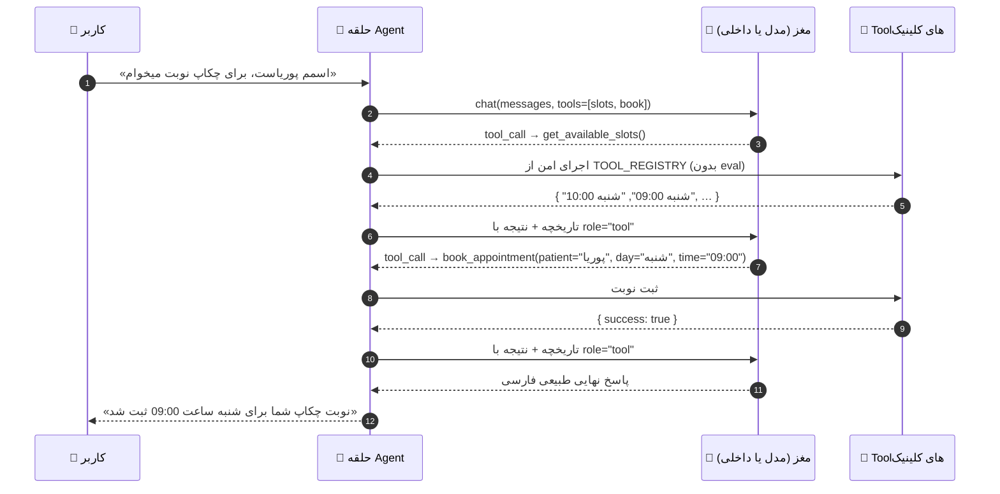

<!-- ─────────────────────────── هدر ─────────────────────────── -->


<div align="center">

[](https://www.python.org/)
[](https://ollama.com/)
[](#-سه-مغز-یک-بدن)
[](#-تستها)
[](../../actions)
[](LICENSE)

[**English**](README.md) · **فارسی**

`۵۶ تست` · `۲ ابزار واقعی` · `وب‌اپ بدون هیچ وابستگی` · `کاملاً آفلاین`

</div>

<div dir="rtl">

## ✨ این پروژه چیست؟

یک **عامل هوشمند (Agent) رزرو نوبت پزشک** است که فارسی حرف می‌زند. شما فقط می‌نویسید:

> «اسمم پوریاست، برای چکاپ نوبت میخوام»

و مدل زبانی — **خودش و بدون هیچ قانون if/else** — تصمیم می‌گیرد اول `get_available_slots` را صدا بزند، برنامه واقعی کلینیک را بخواند، سپس `book_appointment` را اجرا کند و در انتها تأیید بدهد:

> «نوبت چکاپ شما برای شنبه ساعت 09:00 ثبت شد، پوریا عزیز.»

مدل هیچ‌وقت درباره آزاد بودن وقت **حدس نمی‌زند**؛ هر واقعیتی از خروجی واقعی Tool می‌آید که با `role="tool"` به تاریخچه برمی‌گردد — دقیقاً مطابق پروتکل استاندارد Tool Calling — و `temperature=0` رفتار را قطعی و تکرارپذیر نگه می‌دارد. **مدل مغز است، Toolها دست‌های او.**

و نکته‌ای که بیشتر Agentها ندارند: **برای اجرا اصلاً به مدل زبانی هم نیاز ندارید.** یک مغزِ داخلیِ اسکریپت‌شده، همان حلقه و همان Toolها را کاملاً آفلاین می‌چرخاند. پایین‌تر توضیحش را ببینید. 👇

## 🎬 دموی زنده

<div align="center">



*نوشتن فارسی ← بررسی برنامه واقعی پزشک با Tool ← ثبت و تأیید نوبت*

</div>

| کارت رزرو + چیپ ابزار | جزئیات فراخوانی Tool | تم تیره | موبایل |
|:---:|:---:|:---:|:---:|
|  |  |  |  |

## 🧠 سه مغز، یک بدن

کل این Agent مستقل از موتور است؛ هر مغزی که مناسب لحظه‌ات باشد را وصل می‌کنی:



| | 🧠 مغز داخلی | 🦙 Ollama (مدل لوکال) |
|---|---|---|
| نیاز به LLM | **هیچ** | هر مدلِ دارای قابلیت `tools` |
| حجم دانلود | **۰ بایت** | ۴ تا ۲۰ گیگابایت |
| اینترنت | **لازم نیست** | لازم نیست |
| نصب | **هیچی** (فقط پایتون خام) | `pip install -r requirements.txt` |
| حلقه Tool Calling | ✅ همان حلقه با تصمیم‌های اسکریپت‌شده | ✅ تصمیم‌های واقعی مدل |
| مناسب برای | دموی فوری، CI، یادگیری، تست | رفتار شبیه محیط واقعی |

> 💡 **همین حالا امتحانش کن — ۱۰ ثانیه، بدون هیچ نصبی.** اگر پایتون ۳.۱۱+ داری، همه‌چیز آماده است:
>
> ```bash
> python main.py --demo          # دموی ترمینالی — بدون pip install، بدون Ollama، بدون اینترنت
> python web_app.py --mock       # رابط وب کامل با مغز داخلی
> ```
>
> Toolها، حافظه کلینیک، نرمال‌سازی فارسی و کل حلقه **واقعی‌اند** — فقط «تصمیم‌ها» به‌جای شبکه عصبی از مغز اسکریپت‌شده می‌آید. بعداً با یک پرچم (`--model …`) به مدل واقعی سوئیچ کن؛ هیچ‌چیز دیگری عوض نمی‌شود.

## ⚙️ چطور کار می‌کند؟



**محافظ‌های تعبیه‌شده:** نام Tool نامعتبر ← خطای ساختاریافته به مدل برمی‌گردد تا خودش اصلاح کند · آرگومان خراب ← `Invalid arguments` و تلاش مجدد · محافظ حلقه بی‌نهایت (`MAX_TOOL_ITERATIONS=8`) · تگ‌های `<think>` خودکار حذف می‌شوند (qwen3) · همه خطاهای خام Ollama به راهنمای فارسیِ قابل‌فهم ترجمه می‌شوند.

## 🚀 شروع سریع

### 🅰️ مسیر ۱۰ ثانیه‌ای — بدون مدل، بدون دانلود

```bash
cd doctor-agent
python main.py --demo       # چت تعاملی با مغز داخلی
python web_app.py --mock    # یا رابط وب کامل
```

### 🅱️ مسیر کامل — مدل لوکال خودت

```bash
# ۱) نصب Ollama → https://ollama.com/download و سپس:
ollama pull huihui_ai/qwen3-coder-abliterated:30b-a3b   # یا هر مدل دارای Tool Calling

# ۲) نصب وابستگی‌ها (فقط ۲ عدد: ollama + pytest)
python -m venv .venv && source .venv/bin/activate    # ویندوز: .venv\Scripts\activate
pip install -r requirements.txt

# ۳) چت!
python main.py        # بهترین مدل نصب‌شده را خودکار انتخاب می‌کند
python web_app.py     # یا وب‌اپ (مرورگر خودکار باز می‌شود)
```

> 💡 مطمئن نیستید مدلتان Tool صدا می‌زند؟ `python main.py --doctor` اتصال، لیست مدل‌ها و قابلیت `tools` هرکدام را می‌سنجد و بهترین مدل نصب‌شده را خودکار انتخاب می‌کند — پس نبودن تگ دقیق هیچ‌وقت فاجعه نیست.

## 🌐 وب‌اپ — بدون هیچ وابستگی، کاملاً محلی

`web_app.py` فقط با **کتابخانه استاندارد پایتون** ساخته شده (نه Flask، نه Node). چون مرورگرها صفحه‌های اینترنتی را از فراخوانی `localhost:11434` منع می‌کنند (CORS / Private Network)، راه قطعی اجرای وب‌اپ روی سیستم خودتان است:

```text
مرورگر شما ──▶ http://localhost:8000 (web_app.py) ──▶ http://localhost:11434 (Ollama)
                 همه‌چیز محلی می‌ماند — بدون CORS، بدون تنظیم، بدون نصب چیز جدید
```

- 🇮🇷 چت کاملاً فارسی و RTL، تم روشن/تیره، موبایل‌پسند
- 🔍 چیپ‌های **رد Tool** با بازشدن (آرگومان‌ها، خروجی JSON، زمان اجرا به میلی‌ثانیه)
- ✅ کارت سبز **«نوبت شما ثبت شد»** با جزئیات کامل نوبت
- 🧠 انتخابگر مدل — به‌همراه مغز داخلی **«مغز هوشمند محلی»** که اصلاً به مدل نیاز ندارد
- 🎛️ چیپ‌های سناریوی آماده برای تست تک‌کلیکی
- 🔒 قفل API با `--token`، 🌍 لینک عمومی با `--share` (cloudflared/ngrok)

```bash
python web_app.py                # اجرا + باز شدن خودکار مرورگر (http://localhost:8000)
python web_app.py --mock         # دموی کامل با مغز داخلی، بدون هیچ مدلی
python web_app.py --share --token s3cret   # لینک عمومی + قفل توکن
python web_app.py --host 0.0.0.0 --port 8080   # دسترسی از گوشی در همان وای‌فای
```

## 🇮🇷 فهم فارسی که لازم نیست به آن فکر کنید

لایه Tool قبل از رسیدن به منطق کلینیک، همه‌چیز را نرمال می‌کند:

| کاربر می‌گوید (هر شکلی) | فهمیده می‌شود |
|---|---|
| «سه شنبه» / «سه‌شنبه» / ارقام عربی | `سه‌شنبه` استاندارد |
| «۱۵» / «١٥» / "15" | `15` |
| «۳ عصر» / «10 صبح» / «۸ شب» | `15:00` / `10:00` / `20:00` |
| «امروز» / «فردا» / «پس فردا» | نگاشت به هفته کلینیک (از شنبه) |
| «پوریاست» (نام چسبیده به فعل) | بیمار `پوریا` |

## 📁 ساختار پروژه

```text
doctor-agent/
├── main.py               # نقطه ورود CLI: چت تعاملی، --demo، --doctor، --model، --host
├── agent.py              # DoctorAppointmentAgent — حلقه Tool Calling + ترجمه خطاها
├── tools.py              # ۲ Tool + نرمال‌سازی فارسی + TOOL_REGISTRY امن (بدون eval)
├── data.py               # کلینیک Mock: برنامه پزشک + حافظه نوبت‌ها (ClinicState)
├── config.py             # MODEL، temperature=0، محافظ حلقه، System Prompt فارسی ۹ قانونی
├── diagnostics.py        # انتخاب خودکار مدل + عیب‌یابی کامل --doctor (فقط urllib)
├── check_model.py        # تست تک‌ضرب «آیا این مدل واقعاً tool_call می‌دهد؟»
├── web_app.py            # وب‌اپ فقط-استاندارد (رابط چت + REST API + تونل اشتراک)
├── static/               # index.html · app.css · app.js  (RTL، تم روشن/تیره، بدون وابستگی)
├── docs/screenshots/     # demo.gif و اسکرین‌شات‌های همین README
├── tests/                # test_tools · test_agent · test_diagnostics  (۵۶ تست)
├── requirements.txt      # ollama، pytest — همین!
└── LICENSE               # MIT
```

## 🧪 تست‌ها

**۵۶ تست** بدون هیچ سرویس بیرونی — مدل با کلاینت اسکریپت‌شده جایگزین می‌شود؛ پس مجموعه‌تست همه‌جا در ~۰٫۲ ثانیه سبز می‌شود:

```bash
pytest -v
```

- `test_tools.py` — نرمال‌سازی روز/ساعت، اسلات‌ها، رزرو، رزرو تکراری، روز تعطیل، اجرای امن
- `test_agent.py` — هر سناریوهای README به‌صورت انتها-به-انتها + Unknown tool / Invalid arguments / محافظ حلقه
- `test_diagnostics.py` — انتخاب مدل، سنجش قابلیت‌ها، گزارش دکتر

## 🛠️ راهنمای مدل

<details>
<summary><b>کدام مدل‌ها کار می‌کنند؟ (کلیک کنید)</b></summary>

| مدل | نظرم درباره این پروژه |
|---|---|
| `huihui_ai/qwen3-coder-abliterated:30b-a3b` | ⭐ پیش‌فرض — MoE با ۳B فعال، Tool Calling بومی، روی CPU هم سریع |
| `qwen3:4b` / `qwen2.5:7b` / `llama3.1:8b` / `mistral-nemo` | انتخاب‌های کلاسیک مطمئن (حدود ۴ تا ۸ گیگ) |
| `minimax-m3:cloud` | مدل ابری — `ollama signin` و اینترنت می‌خواهد |
| `alduin-4b` (دوستدار فارسی) | سبک، ولی اول با `python check_model.py --model …` بسنجید |

قاعده کلی: مدل **باید** قابلیت `tools` را داشته باشد — با `ollama show <model>` (دنبال کلمه `tools`) یا `python check_model.py` چک کنید. و یادتان باشد: نداشتن هیچ مدلی هم یک انتخاب کاملاً معتبر است — مغز داخلی (بخش بالا) همه‌چیز را اجرا می‌کند.
</details>

## 🧯 مسئله‌یابی

<details>
<summary><b>مشکلی پیش آمده؟ (کلیک کنید)</b></summary>

| نشانه | راه‌حل |
|---|---|
| `Connection refused` | Ollama را اجرا کنید: `ollama serve` — بعد `python main.py --doctor` |
| `model … not found` | برنامه نزدیک‌ترین مدل نصب‌شده را خودکار برمی‌دارد؛ نصب: `ollama pull <model>` |
| مدل حرف می‌زند ولی نوبت ثبت نمی‌کند | مدل قابلیت `tools` ندارد → مدل دیگر انتخاب کنید (جدول بالا) |
| وب‌اپ به Ollama وصل نمی‌شود | وب‌اپ را محلی اجرا کنید (`python web_app.py`) — همان مسیر بدون CORS |
| فارسی به‌هم‌ریخته در ترمینال ویندوز | `set PYTHONUTF8=1` |
| «حداکثر تعداد فراخوانی Tool پر شد» | `MAX_TOOL_ITERATIONS` را در `config.py` بیشتر کنید |
| اصلاً GPU و اینترنت ندارید؟ | عادی است: `python main.py --demo` یا `python web_app.py --mock` |

> 🩺 **یک دستور برای تقریباً همه‌چیز:** `python main.py --doctor`
</details>

## 🗺️ نقشه راه

- [ ] خروجی استریمی توکن‌به‌توکن (Ollama NDJSON → SSE)
- [ ] Fallback چند-Provider (OpenAI / DeepSeek / Groq …)
- [ ] بات تلگرام با کیبورد شیشه‌ای
- [ ] خروجی Google Calendar
- [ ] ذخیره‌سازی پایدار (SQLite) به‌جای حافظه درون-حافظه‌ای

## 🤝 مشارکت

پول‌ریکوئست خوش‌آمدید! برای تغییرات بزرگ اول یک Issue باز کنید. قبل از ارسال `pytest -v` را اجرا کنید — کل مجموعه‌تست باید بدون Ollama هم سبز بماند.

## 📄 لایسنس

[MIT](LICENSE) — آزاد برای استفاده، تغییر و انتشار. اگر این ریپو به‌دردتان خورد، یک ⭐ حسابی دلمان را شاد می‌کند.

</div>

<div align="center">


<sub>ساخته‌شده با ❤️ و `temperature=0` — هوش مصنوعیِ قطعی، تست‌پذیر و صادق.</sub>

</div>


