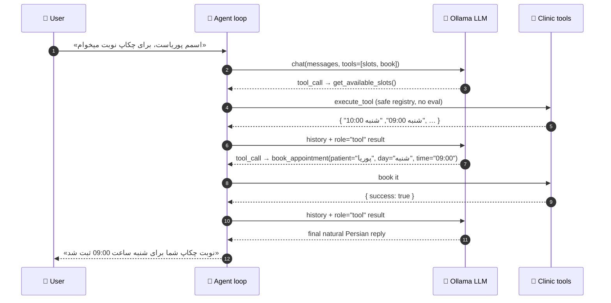

<!-- ─────────────────────────── HEADER ─────────────────────────── -->


<div align="center">

[](https://www.python.org/)
[](https://ollama.com/)
[](#-testing)
[](LICENSE)


**English** · [**فارسی**](README.fa.md)

</div>

---

## ✨ What is this?

A production-style **AI booking agent** that speaks Persian. You type:

> «اسمم پوریاست، برای چکاپ نوبت میخوام»

…and the LLM decides — **on its own** — to call `get_available_slots`, reads the clinic schedule, calls `book_appointment`, and confirms:

> «نوبت چکاپ شما برای شنبه ساعت 09:00 ثبت شد، پوریا عزیز.»

The model never "guesses" availability. Every fact comes from a real tool result fed back with `role="tool"`, exactly like the standard OpenAI/Ollama tool-calling protocol — with `temperature=0` for deterministic, reproducible behavior. No if-else intent matching anywhere: **the LLM is the brain, the tools are its hands.**

## 🎬 Live Demo

<div align="center">


*Typing in Persian → agent inspects the real schedule via tools → appointment confirmed.*

</div>

| Booking card + tool chips | Expanded tool trace | Dark mode | Mobile |
|:---:|:---:|:---:|:---:|
|  |  |  |  |

## ⚙️ How it works



**Built-in safety rails:** invalid tool name → structured error back to the model so it self-corrects · malformed arguments → `Invalid arguments` retry · infinite loop guard (`MAX_TOOL_ITERATIONS=8`) · `<think>` tags stripped automatically (Qwen3) · every raw Ollama error translated into clear Persian guidance.

## 🚀 Quick Start

```bash
# 1) Install Ollama → https://ollama.com/download, then:
ollama pull huihui_ai/qwen3-coder-abliterated:30b-a3b   # or any tool-capable model

# 2) Install deps (only 2: ollama + pytest)
cd doctor-agent
python -m venv .venv && source .venv/bin/activate    # Windows: .venv\Scripts\activate
pip install -r requirements.txt

# 3a) Chat in the terminal
python main.py

# 3b) …or open the web app (opens your browser automatically)
python web_app.py
```

> 💡 Not sure whether your model supports tools? Run `python main.py --doctor` — it checks connectivity, lists models, tests each one's `tools` capability and auto-picks the best installed model. The app also **auto-resolves** your closest installed model at startup, so a missing exact tag is never fatal.

No GPU / no Ollama around? Still works: `python main.py --demo` (scripted brain, **real** tools, **real** clinic state) or `python web_app.py --mock`.

## 🌐 Web App — zero dependencies, all local

`web_app.py` is pure **Python standard library** (no Flask, no Node). Browsers block public pages from calling `localhost:11434` (CORS / Private Network), so the bullet-proof path is running the app on your own machine:

```text
your browser ──▶ http://localhost:8000 (web_app.py) ──▶ http://localhost:11434 (Ollama)
                     everything stays local — no CORS, no setup, no extra install
```

- 🇮🇷 Full RTL Persian chat, light/dark themes, mobile-friendly
- 🔍 Expandable **tool-trace chips** (arguments, JSON result, execution time in ms)
- ✅ Green **"نوبت شما ثبت شد"** card with full appointment details
- 🧠 Model picker (only models actually installed; models without tool support are flagged)
- 🎛️ Quick-action chips for one-click scenarios
- 🔒 Optional `--token` API lock, 🌍 `--share` public tunnel (cloudflared/ngrok)

```bash
python web_app.py                # run + auto-open browser (http://localhost:8000)
python web_app.py --mock         # full demo without any model
python web_app.py --share --token s3cret   # public link + API lock
python web_app.py --host 0.0.0.0 --port 8080   # reach from your phone on same Wi-Fi
```

## 🇮🇷 Persian NLU you don't have to think about

The tool layer normalizes everything before the clinic logic sees it:

| User says (any form) | Understood as |
|---|---|
| «سه شنبه» / «سه‌شنبه» / Arabic digits | canonical `سه‌شنبه` |
| «۱۵» / «١٥» / "15" | `15` |
| «۳ عصر» / «10 صبح» / «۸ شب» | `15:00` / `10:00` / `20:00` |
| «امروز» / «فردا» / «پس فردا» | mapped through the clinic week (starts Saturday) |
| «پوریاست» (name glued to verb) | patient `پوریا` |

## 📁 Project Structure

```text
doctor-agent/
├── main.py               # CLI entry: interactive chat, --demo, --doctor, --model, --host
├── agent.py              # DoctorAppointmentAgent — the tool-calling loop + error translation
├── tools.py              # 2 tools + Persian normalization + safe TOOL_REGISTRY (no eval)
├── data.py               # Mock clinic: doctor schedule + in-memory bookings (ClinicState)
├── config.py             # MODEL, temperature=0, loop guard, the 9-rule Persian system prompt
├── diagnostics.py        # auto model resolution + --doctor full diagnostics (urllib only)
├── check_model.py        # one-shot "does this model really emit tool_calls?" tester
├── web_app.py            # stdlib-only web app (chat UI + REST API + tunnel sharing)
├── static/               # index.html · app.css · app.js  (RTL, dark/light, zero deps)
├── docs/screenshots/     # demo.gif + UI screenshots used by this README
├── tests/                # test_tools · test_agent · test_diagnostics  (56 tests)
├── requirements.txt      # ollama, pytest — that's all
└── LICENSE               # MIT
```

## 🧪 Testing

**56 tests**, zero external services — the model is replaced by a scripted client, so the suite runs anywhere in ~0.2s:

```bash
pytest -v
```

- `test_tools.py` — time/day normalization, slots, booking, duplicates, closed days, safe dispatch
- `test_agent.py` — all README scenarios end-to-end + Unknown tool / Invalid arguments / loop guard
- `test_diagnostics.py` — model resolution, capability probing, doctor report

## 🛠️ Model Guide

<details>
<summary><b>Which models work? (click to expand)</b></summary>

| Model | Verdict for this project |
|---|---|
| `huihui_ai/qwen3-coder-abliterated:30b-a3b` | ⭐ default — MoE, only 3B active params, native tool calling, fast even on CPU |
| `qwen3:4b` / `qwen2.5:7b` / `llama3.1:8b` / `mistral-nemo` | solid classic choices (~4-8 GB) |
| `minimax-m3:cloud` | cloud model — needs `ollama signin` + internet |
| `alduin-4b` (Persian-friendly) | light, but verify with `python check_model.py --model …` first |

Rule of thumb: the model **must** support Ollama's `tools` capability — check with `ollama show <model>` (look for `tools`) or `python check_model.py`.
</details>

## 🧯 Troubleshooting

<details>
<summary><b>Something not working? (click to expand)</b></summary>

| Symptom | Fix |
|---|---|
| `Connection refused` | start Ollama: `ollama serve` — then `python main.py --doctor` |
| `model … not found` | app auto-picks the closest installed model; install yours: `ollama pull <model>` |
| Model chats but never books | model lacks the `tools` capability → pick another (table above) |
| Web app can't reach Ollama | run the web app locally (`python web_app.py`) — that's the no-CORS path |
| Persian looks broken in Windows terminal | `set PYTHONUTF8=1` |
| «حداکثر تعداد فراخوانی Tool پر شد» | raise `MAX_TOOL_ITERATIONS` in `config.py` |

> 🩺 **One command for almost everything:** `python main.py --doctor`
</details>

## 🗺️ Roadmap

- [ ] Streaming token output (Ollama NDJSON → SSE)
- [ ] Multi-provider fallback (OpenAI / DeepSeek / Groq …)
- [ ] Telegram bot with inline keyboards
- [ ] Google Calendar export
- [ ] Persistent storage (SQLite) instead of in-memory state

## 🤝 Contributing

PRs are welcome! For anything non-trivial, open an issue first. Run `pytest -v` before submitting — the whole suite must stay green and Ollama-free.

## 📄 License

[MIT](LICENSE) — free to use, modify and ship. If this repo helped you, a ⭐ would make our day.

<div align="center">

<br/>
<sub>Made with ❤️ and `temperature=0` — deterministic, testable, honest AI.</sub>

</div>


